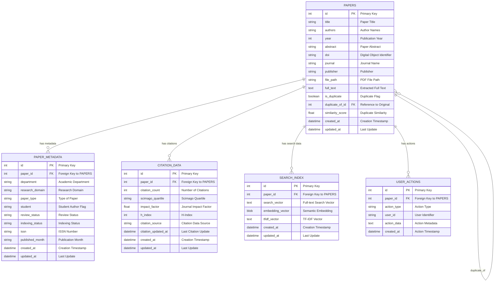

# Unified Architecture and Diagrams

## 1. High-Level System Architecture


## 2. End-to-End Import Flow (Sequence)


## 3. Search Flow (Sequence)


## 4. Unified Database Architecture (ER Diagram)


## 5. Detailed Entity Relationship Diagram (ERD)


## 6. Database Schema Details

### 6.1 Table Definitions
- **PAPERS**: Core paper information with bibliographic data
- **PAPER_METADATA**: Research-specific metadata and classifications
- **CITATION_DATA**: Citation metrics and impact factors
- **SEARCH_INDEX**: Search vectors and embeddings for retrieval
- **USER_ACTIONS**: User interaction tracking and analytics

### 6.2 Key Relationships
- One-to-Many: Papers → Metadata, Citations, Search Index, User Actions
- Self-Reference: Papers → Papers (duplicate relationships)
- Foreign Keys ensure referential integrity

### 6.3 Indexes and Performance
- Primary keys on all tables
- Foreign key indexes for join performance
- Full-text search indexes on search_vector
- Composite indexes on frequently queried fields

## 7. Component Diagram (Modules)


## 8. Deployment Diagram
```mermaid
graph TD
    User((User)) -->|Qt Desktop| App[Research Paper Browser]
    App --> DB[(SQLite File data/database.db)]
    App --> HF[Hugging Face Hub]
    App --> CR[Crossref API]
    App --> DOAJ[DOAJ/ISSN]
    App -.-> Proxy[HTTP/HTTPS Proxy (optional)]
```

## 9. State Machine (Paper Lifecycle)


## 11. Performance & Scalability Notes
- Batch embedding generation recommended after imports
- Keep working set within memory by clearing cache when not needed
- Apply filters to reduce candidate sets before ranking
- Repository abstraction eases migration to larger backends if required

## 12. Security & Privacy
- Local-only processing by default; network use limited to metadata APIs and model downloads
- No telemetry; in-memory caches cleared on exit

## 13. Responsibilities & Ownership
- UI flows and interactions: GUI layer
- Coordination and business logic: Integration Manager
- Persistence and schema evolution: Database Unified
- ML/Search: Utilities under `app/utils/`

## 10. Additional System Architecture Diagram (Ingestion and Indexing Pipeline)

